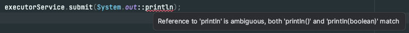

# 다중정의는 신중히 사용하라 
## 다중 정의(오버로딩)
```java
// 예제 
public class CollectionClassifier {
    public static String classify(Set<?> set) {
        return "Set";
    }

    public static String classify(List<?> list) {
        return "List";
    }

    public static String classify(Collection<?> collection) {
        return "Etc";
    }

    public static void main(String[] args) {
        Collection<?>[] collections = {
                new HashSet<String>(),
                new ArrayList<BigInteger>(),
                new HashMap<String, String>().values()
        };

        for (Collection<?> collection : collections) {
            System.out.println(classify(collection));
        }
    }
}

// 출력 결과 
Etc
Etc
Etc
```

### 위와 같이 Etc만 연달아 출력하는 이유
- 다중정의(오버로딩)된 세 classify 중, 어느 메서드를 호출할지가 "컴파일 타임"에 정해지기 때문 
- 위 예제는 런타임에는 타입이 매번 달라질 수 있지만, 컴파일 타임에는 무조건 `Collection<?>`타입이다.
  - 즉, 호출할 메서드를 선택하는 데는 런타임 때의 타입이 영향을 주지 못한다.


### 오버라이딩과 오버로딩의 차이 
- 오버라이딩 : 재정의한 메서드는 동적으로 선택된다.
  - 메서드를 재정의한 경우, 해당 객체의 런타임 타입이 어떤 메서드를 호출할지의 기준이 됨 
  - 메서드 재정의란, 상위 클래스가 정의한 것과 똑같은 시그니처의 메서드를 하위 클래스에서 다시 정의한 것 
- 예시: 버거킹의 Whopper
  - 컴파일 타임 타입이 모두 `Whopper`인 것과 무관하게, 가장 하위에서 정의한 재정의 메서드가 실행 됨 
```java
//오버라이딩 예시
public class Whopper {
  String patty() {
    return "패티 1장";
  }

  static class TwoStackWhopper extends Whopper {
    @Override
    String patty() {
      return "패티 2장";
    }
  }

  static class ThreeStackWhopper extends Whopper {
    @Override
    String patty() {
      return "패티 3장";
    }
  }

  public static void main(String[] args) {
    List<Whopper> whoppers = List.of(
            new Whopper(),
            new TwoStackWhopper(),
            new ThreeStackWhopper()
    );

    for (Whopper whopper : whoppers) {
      System.out.println(whopper.patty());
    }
  }
}

// 출력 결과 
패티 1장
패티 2장
패티 3장
```


- 오버로딩 : 다중정의한 메서드는 정적으로 선택된다.
  - 객체의 런타임 타입은 전혀 중요하지 않음. 
  - 선택은 컴파일타임에, 오직 매개변수의 컴파일타임 타입에 의해 이뤄짐 

### 다중정의한 메서드는 프로그래머가 기대한것과 다르게 동작할 수 있다 
- 헷갈릴 수 있는 코드는 작성하지 말자.
- 다중정의가 혼동을 일으키는 상황은 피해야 한다.
- 안전하고 보수적으로 가려면, 매개변수의 수가 같은 다중정의는 만들지 말자.
 - 특히, 가변 인수를 사용하는 메서드의 경우 다중정의를 아예 하지 말아야 한다. 
 - 다중정의를 하는 대신 메서드 이름을 다르게 지어주는 길도 항상 열려있다.

### 매개변수 중 하나 이상이 근본적으로 다를 경우, 헷갈릴 일이 없다. 
- 근본적으로 다른 경우 : `null`이 아닌 두 타입의 값을 어느 쪽으로든 서로 형변환이 불가


### 자바에 래퍼 클래스와 오토박싱이 도입되면서...
```java
public class SetList {
    public static void main(String[] args) {
        Set<Integer> set = new TreeSet<>();
        List<Integer> list = new ArrayList<>();

        for (int i = -3; i < 3; i++) {
            set.add(i);
            list.add(i);
        }

        for (int i = 0; i < 3; i++) {
            set.remove(i);
            list.remove(i);
        }

        System.out.println(set + " " + list);
    }
}

// 예상 결과 
[-3, -2, -1] [-3, -2, -1]
        
// 실제 결과 
[-3, -2, -1] [-2, 0, 2]
```

왜 위와 같은 일이 발생할까?
- `set.remove(i)`의 시그니처는 `remove(Object)`이다.
  - 따라서, 기대한 대로 동작하여 0 이상의 수들을 제거한다.
- 한편, `list.remove(i)`는 다중정의된 `remove(int index)`를 선택하게 된다.
  - 따라서, 0, 1, 2번 인덱스의 원소를 제거 해버린다. 
  - `list.remove(Integer.valueOf(i))`를 하면 `remove(Object)`로써 동작한다. 


해당 예시가 혼란스러웠던 이유는 `List<E>`인터페이스가  `remove(Object)`와 `remove(int)`를 다중정의했기 때문이다.


### 자바 8에서 도입한 람다와 메서드 참조 역시 다중정의 혼란이 존재한다.
```java
// 컴파일 오류 안남 
new Thread(System.out::println).start();

// 컴파일 오류 남
ExecutorService executorService = Executors.newCachedThreadPool();
executorService.submit(System.out::println);
```
`ExecutorService`의 `submit`이 다중정의 되어 있어 컴파일 오류가 난다.
- `submit`은 `Runnable`뿐만 아니라, `Callable<T>`를 받는 메서드도 있다. 


하지만, `println`은 `void`를 반환할텐데, 왜 `Runnable`과 `Callable`을 구분하지 못할까?
- 다중정의 해소(resolution; 적절한 다중정의 메서드를 찾는 알고리즘)는 그렇게 동작하지 않기 떄문이다.
- 만약 `println`이 다중정의 없이 단 하나만 존재했다면, 해당 `submit`메서드는 컴파일 에러가 나지 않았을 것이다.


위 예시는, 참조된 메서드인 `println`과 호출한 메서드인 `submit`이 모두 다중정의되어, 다중정의 해소 알고리즘이 우리의 기대처럼 동작하지 않는 상황이다.
- `System.out::println`은 부정확한 메서드 참조이기 때문이다.
  > 부정확한 메서드 참조 & 암시적 타입 람다식
  > - 목표 타입이 선택되기 전에는 그 의미가 정해지지 않는다.
  > - 이는 적용성 테스트(applicability test) 때 무시된다. -> 이것이 문제의 원인.

---
### 위 내용에 대한 나의 뇌피셜
> [뇌피셜 주의] 저의 지식 한계로 인한 뇌피셜입니다 ㅠㅠ 틀린부분 있을 시 지적 부탁드립니다!

아무래도..`println`이 많은 오버로딩 메서드가 있어서 "부정확하다"고 표현하는 것 같은데... 

이를 알아보기 위해 조금 더 찾아보던 중, 해당 내용에 대해 조슈아 블로크 선생님이 트위터를 남겨둔걸 발견했다.([해당 트위터 글](https://twitter.com/joshbloch/status/921881630809014272))

뭐 명확한 답은 얻질 못했지만, 하나의 힌트는 얻을 수 있었다. 바로, `println`메서드에는 **인수를 받지 않는 메서드**도 오버로딩되어 구현되어 있다는 점이다.


그러면 `System.out::println`이 모호한 메서드 참조인 이유는 "인수를 받지 않는 경우"와 "인수를 받는 경우"가 구분이 안가기 때문인 것으로 추측된다. 
실제로, 컴파일러도 아래와 같이 `println()`과 `println(boolean)`이 서로 구별이 되지 않는다고 경고하고 있다.  


그런데, 사실 `System.out::println`과 같은 메서드 참조는 `foreach`같은 메서드에서는 잘 쓰고 있지 않았던가..? 왜 위 예시에서는 컴파일 에러가 발생하고, `foreach`같은 곳에서는 컴파일 에러가 발생하지 않는걸까?

```java
List<String> hi = List.of("하잉", "바잉", "뀨잉");
hi.stream().forEach(System.out::println);
```
위의 `foreach`예시를 보자. 이는 컴파일 에러가 발생하지 않는다. 이유는 다음과 같다고 추측된다. 
- `System.out::println`이 **모호하지 않고 확실히 인자를 받는 메서드**이다.

즉, 위에서 사용된 `System.out::println`은 모호하지 않고 확실하다고 볼 수 있다. `stream()`에서 인자가 넘어오기 때문에, 확실하게 `(object) -> System.out.println(object)`라고 할 수 있다.


반면에, `excutorService.submit(System.out::println)`에 사용된 `System.out::println`은 모호하다고 볼 수 있다. 

해당 메서드 참조가 **인수를 받는 경우**인지, **인수를 받지 않는 경우**인지 불확실하기 때문이다.

위에서 언급된 "목표 타입이 선택되기 전에는 그 의미가 정해지지 않는다." 가 여기에 적용되는 말이 아닐까?

- `submit()`의 인수로 넘겨진 `System.out::println`은 아직 목표 타입이 정해지지 않았다. (`Runnable` or `Callable`)
- 심지어 `System.out::println`이 인수를 받는 경우인지, 인수를 받지 않는 경우인지도 정해지지 않았다.

따라서, 정해진게 아무것도 없으므로 아주 모호한 상태라는 것이다. 때문에, `System.out::println`은 `submit()`에 사용될 수 없다는 뜻이 아닐까? 라고 결론지었다.

아직 한번에 이해하기는 너무 어려운 내용이었던 것 같다. 일단은 조슈아 선생님이 컴파일러 개발자가 아니면 굳이 알지 않아도 된다 했으니.. 일단은 여기까지만 하고 넘어가기로 했다. (생각이 꼬리에 꼬리를 물고 해결이 안되는 지경에 이르렀기 때문 ㅠㅠ)

> 또 다른 생각
> 
> 하지만, `submit()`은 `Runnable` 혹은 `Callable<T>`만 받는다. 그렇다면 `System.out::println`은 `Runnable`로 인식되면 그만 아닌가..? 라는 생각이 든다. 
> 
> 위와 같이 생각한 이유는, `System.out::println`은 `Callable<T>`의 시그니처를 만들 수 없기 때문이다. 모호하지 않을 수도 있다고 생각했지만, 자바 컴파일러는 아닌가보다 ㅠ


> 추가 참고 자료 
>
> https://docs.oracle.com/javase/specs/jls/se8/html/jls-15.html
---


- 위 내용에 대한 핵심은..
  - 다중정의된 메서드(혹은 생성자)들이 함수형 인터페이스를 인수로 받을 때, 비록 서로 다른 함수형 인터페이스라도 인수 위치가 같으면 혼란이 생긴다는 것.


- 즉, 메서드를 다중정의할 때, 서로 다른 함수형 인터페이스라도 같은 위치의 인수로 받아서는 안된다.  
  - 서로 다른 함수형 인터페이스라도 서로 근본적으로 다르지 않다는 뜻 
  - 컴파일할 때 명령줄 스위치로 -Xlint:overloads를 지정하면, 해당 종류의 다중 정의를 아래와 같이 경고해줄 것임
```text
javac -Xlint:overloads  FunctionalEx.java
FunctionalEx.java:16: warning: [overloads] <T#1>functionalTest(Consumer<T#1>) in FunctionalEx is potentially ambiguous with <T#2>functionalTest(Predicate<T#2>) in FunctionalEx
    static <T> void functionalTest(Consumer<T> consumer) {
                    ^
  where T#1,T#2 are type-variables:
    T#1 extends Object declared in method <T#1>functionalTest(Consumer<T#1>)
    T#2 extends Object declared in method <T#2>functionalTest(Predicate<T#2>)
1 warning
```


## 근본적으로 다른 관계  
- `Object`외의 클래스 타입과 배열 타입
- `Serializable`과 `Cloneable`외의 인터페이스 타입과 배열 타입
- `String`과 `Throwable`(관련 없는 관계)

## 자바 라이브러리의 실패한 예시
### String의 contentEquals()
- 상대적으로 더 특수한 다중정의 메서드에서 덜 특수한 다중정의 메서드로 일 넘겨서 문제 없게 만드는 방법
```java
public boolean contentEquals(StringBuffer sb) {
    return contentEquals((CharSequence) sb);
}
```

### String의 valueOf()
- `valueOf(char[])`와 `valueOf(Object)`는 같은 객체를 건네도 전혀 다른일을 수행함
- 이렇게 해야 할 이유가 없었음에도, 혼란을 불러올 수 있는 잘못된 사례가 되어버림 

---
## 정리 
- 다중정의를 허용한다고, 반드시 활용하란 뜻은 아님


- 매개변수 수가 같을 땐 다중정의를 피하자 
  - 생성자는 해당 조언을 따르기 어려울 수 있다. 헷갈릴만한 매개변수는 형변환 하여 정확한 다중정의 메서드가 선택되도록 하자


- 기존 클래스를 수정해 새로운 인터페이스를 구현해야 할 때는 같은 객체를 입력받는 다중정의 메서드들이 모두 동일하게 동작하도록 만들자.


---
## 짧은 내 생각!
결론은 메서드 오버로딩은 조심해서 쓰라는 것 같다. 컴파일러가 구분하지 못하는 이유를 찾아 헤맸으나, 이렇다 할 성과는 보지 못한 것 같다.. 나중에 지식을 더 많이 쌓은 후에 깊은 뜻을 헤아려보도록 해야곘다. (아니면 기선님 강의 존버라도..ㅋㅋㅋ) 