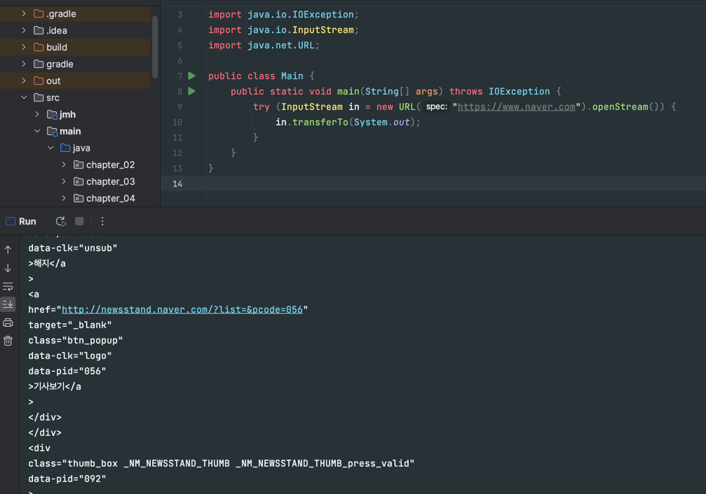

# 라이브러리를 익히고 사용하라
## 표준 라이브러리 사용 시 누릴 수 있는 이점
- 그 코드를 작성한 전문가의 지식과 여러분보다 앞서 사용한 다른 프로그래머들의 경험을 활용할 수 있다.
- 핵심적인 일과 크게 관련 없는 문제를 해결하느라 시간을 허비하지 않아도 된다. 
- 따로 노력하지 않아도 성능이 지속해서 개선된다.
- 기능이 점점 많아진다.
- 우리가 작성한 코드가 많은 사람에게 낯익은 코드가 된다.
  - 더 읽기 좋고, 유지보수하기 좋으며, 재활용하기 쉬운 코드가 된다.


## 위의 이점을 생각해서라도 라이브러리를 익히자
- 메이저 릴리스마다 주목할만한 수많은 기능이 라이브러리에 추가된다.
- 릴리스마다 새로운 기능을 설명하는 웹 페이지를 공시하니 읽어볼 것을 권장한다.


예를 들어 위와 같은 기능이 있다.(`transferTo`) 
- 이는 지정한 URL의 내용을 가져오는 기능이며, 자바 9에서 추가됐다.
- 예전에는 작성하기가 까다로운 기능이었지만, 라이브러리에서 제공 해줌으로써 손쉽게 사용할 수 있다.


## 자바 프로그래머라면 
- `java.lang`
- `java.util`
- `java.io`

위 세 가지의 라이브러리와 하위 패키지들에는 익숙해지자. 다른 라이브러리들은 필요할 때마다 익히면 된다. 


## 다른 라이브러리 중에서 
- 컬렉션 프레임워크
- 스트림 라이브러리 
- 동시성 기능

위 세 가지도 알아두면 큰 도움이 된다.

---

## 정리
- 우선은 라이브러리를 사용하도록 시도해라 
  - 없다면 대안을 사용해라 (고품질의 서드파티 라이브러리 등)
    - 구글 구아바 라이브러리가 대표적 
- 바퀴를 다시 발명하지 말자.
- 라이브러리를 쓰자. 있는지 모르겠다면 찾아보고 쓰자. 

---

## 나의 생각
있는 라이브러리를 사용하는 것도 중요하지만, 잘 알고 쓰는 것도 중요한 것 같습니다. 저는 QueryDSL의 `_super`키워드가 있는지 몰라서, JPA에 대해 잘 알지 못한 채 써서, 리플렉션에 대해 잘 알지 못한 채 써서 몇 시간을 삽질한 경험이 있습니다.

그럴 때 마다 느끼는 것은 잘 알고 사용하자 인데, 사실 "잘 알고"가 조금 어려운 것 같습니다. 상세한 내용들까진 아니더라도, 기본적인 개념이나 아키텍처라도 잘 알고 쓴다면, 문제 해결에 도움이 되지 않을까 생각합니다.


---

## 책에서 나온 소소한(?) 팁
- 자바 7부터는 `Random`보다는 `ThreadLocalRandom`으로 대체하라.
  - 더 빠르고 고품질의 난수를 생성한다.
  - 병렬 스트림이나 포크조인 풀에서는 `SplittableRandom`사용


책에서, 위와 같이 `Random`을 사용하지 말고 `ThreadLocalRandom`을 사용할 것을 권고하고 있습니다. 더 빠르기 때문이라는데.. 왜 더 빠를 수 있는걸까 궁금해서 좀 더 찾아보았습니다.

`ThreadLocalRandom`이 더 빠를 수 있는 이유는, `Random`에는 스레드 경합 지점이 될 수 있는 부분이 있기 때문인 것으로 추측됩니다. 어디가 스레드 경합이 발생하는지 한번 살펴보겠습니다.

`Random`의 `nextInt()`입니다.
```java
public int nextInt() {
    return next(32);
}
```

해당 메서드 안에 있는 `next()`입니다.
```java
protected int next(int bits) {
    long oldseed, nextseed;
    AtomicLong seed = this.seed;
    do {
        oldseed = seed.get();
        nextseed = (oldseed * multiplier + addend) & mask;
    } while (!seed.compareAndSet(oldseed, nextseed));
    return (int)(nextseed >>> (48 - bits));
}
```

내부에 `AtomicLong`이 있습니다. 이는 스레드에 안전하도록 만든 클래스이며, concurrent 패키지에 있습니다. Atomic 클래스들은 "낙관적 락"기법을 사용하여 스레드에 안전하도록 만들었다고 합니다.

비관적 락 방식은 애초에 락이 걸려있으면 진입을 못하는 반면, 낙관적 락 방식은 일단 진입하고 봅니다. `AtomicLong`은 `compareAndSet`을 통해 낙관적 락을 구현했다고 합니다.

해당 메서드는 네이티브 메서드로, 정확한 기작은 확인할 수 없었지만, 대략적으로 다음과 같이 동작한다고 합니다.

- 가지고 있었어야 할 값을 그대로 가지고 있다면 수정을 한다.
  - 기대 했던 값과 일치함 -> 업무를 수행함
  - 기대 했던 값과 다름 -> 업무를 수행하지 않음 (예외/재시도 등을 해야함)

따라서, 다음과 같이 동작합니다.
- compareAndSet이 실패하면 계속 반복 -> 새로운 값을 가져와서 반복
- 스레드가 동시에 접근했다면 둘중 하나는 무조건 실패함 -> 재시도


자세한 원리를 파악하기엔, 아직 동시성이라는 개념이 익숙하지가 않아 어려움이 있었습니다. 하지만, 중요한 점은 "두 개의 스레드가 해당 지점에서 경합이 발생하면 무조건 하나는 실패하고 재시도 한다."라는 것입니다. 즉, 이 부분에서 성능 이슈가 발생할 수 있다고 합니다.


해당 문제는 `ThreadLocal`을 사용하도록 만든 `ThreadLocalRandom`을 도입하면 해결할 수 있다고 합니다.
- `ThreadLocal`이란
  - 스레드 범위의 변수, 즉 스레드 scope를 가지는 변수를 의미합니다. 각 스레드마다 독립적으로 사용할 수 있는 변수입니다.
  - 사용처 : Spring의 트랜잭션 AOP가 커넥션을 관리할 때 사용함. (트랜잭션 동기화 매니저) 


해당 클래스는 다음과 같이 동작함으로써, 스레드 경합을 피할 수 있습니다.
- 현재 스레드에 할당되어있는 랜덤을 가져옴 -> 스레드마다 독립적이기 때문에 경합이 발생할 일이 없음 -> 성능 개선 


아무래도 스레드 경합, 데드락 등의 문제로 인해 저자는 `ThreadLocalRandom`을 사용하라고 한 것 같습니다. 이에 따라, 단일 스레드 환경에서 랜덤을 사용한다 하더라도 `ThreadLocalRandom`을 사용하는 습관을 들이면 좋을 것 같습니다.

